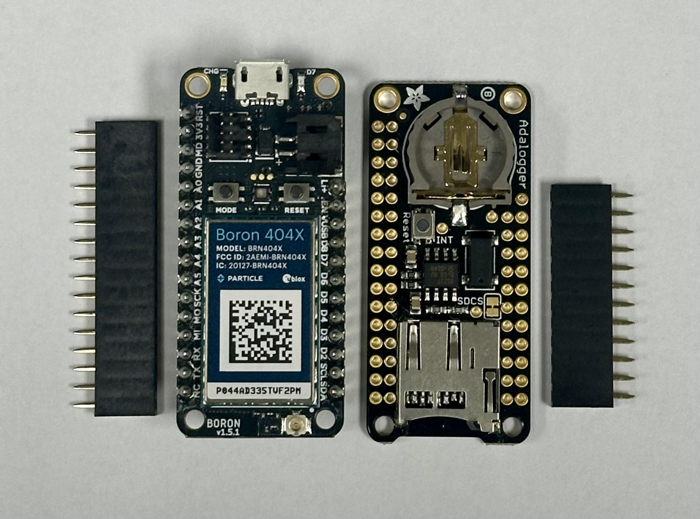
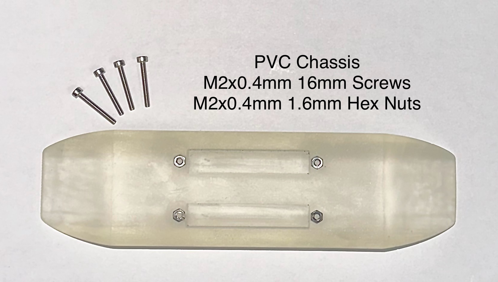
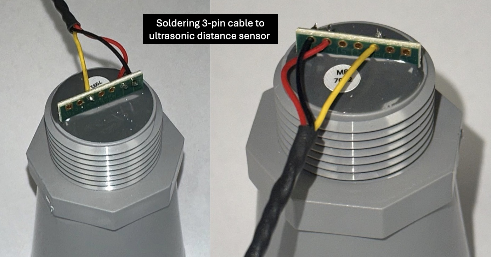
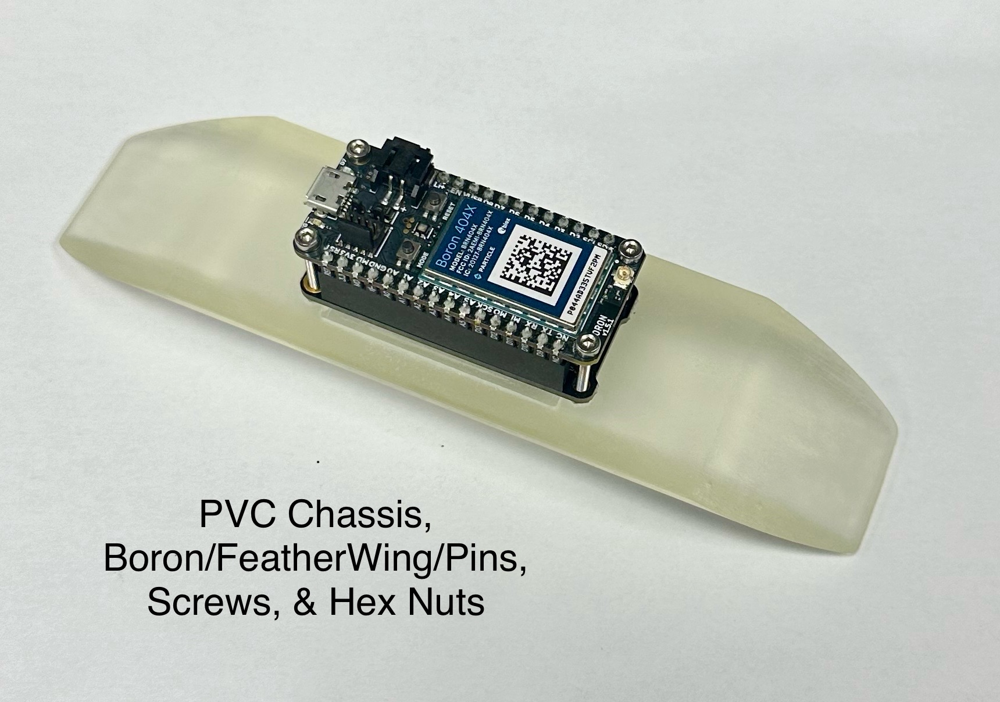
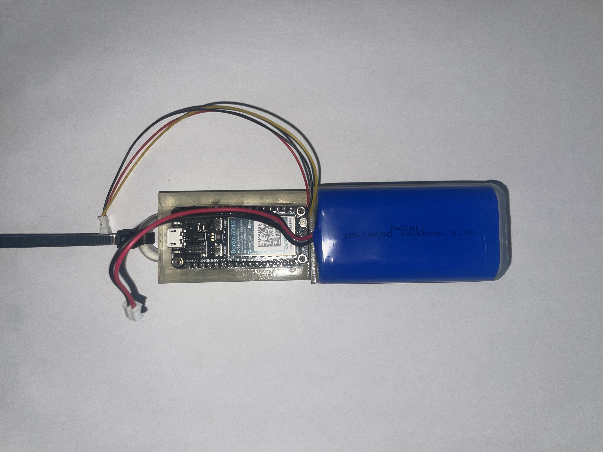
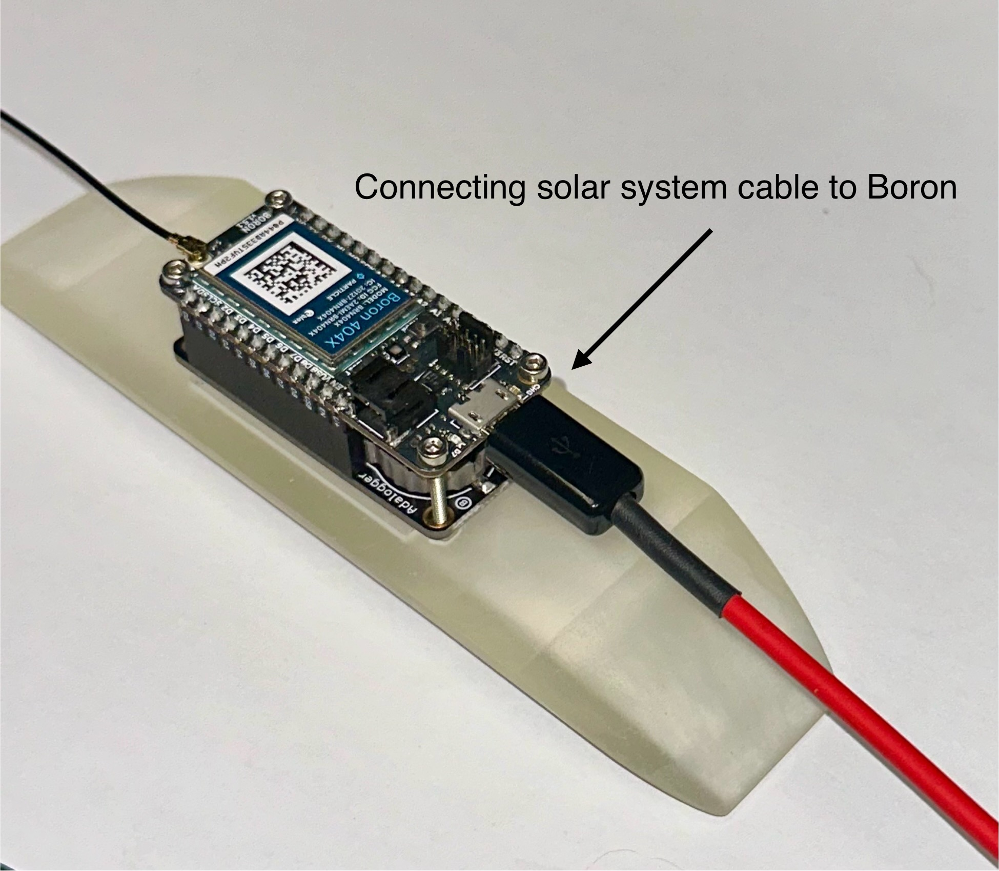
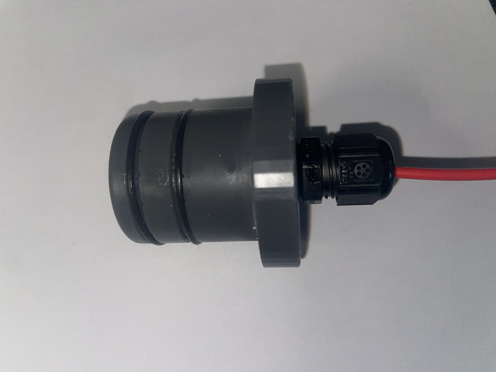
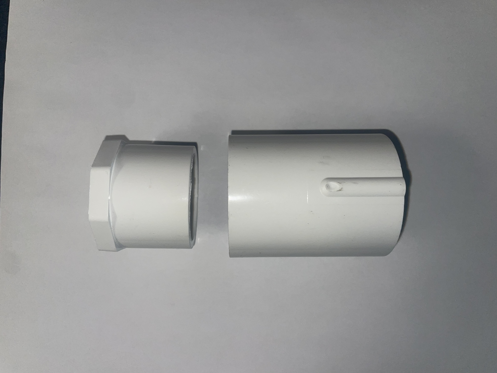
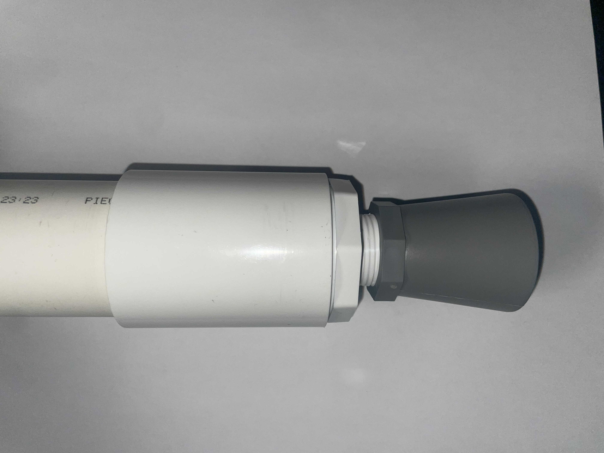
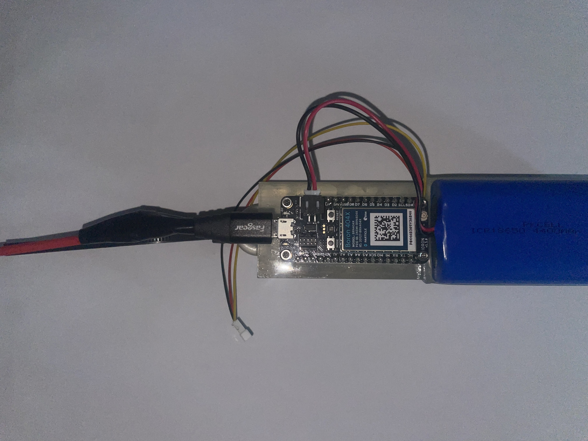

We're working on this page!
Come back soon for accurate step-by-step assembly instructions.

# How to assemble a DIY Open Water Level Sensor with a PVC enclosure
See:
- BOM, for bills of materials / lists of parts
- Datasheets, for manufacturer datasheets
- Enclosure and Assembly, for 3D print files

## Assembling the chassis
Parts:
- Boron 404X
- Adalogger FeatherWing
- MicroSD card
- Short stacking header pins
- 1.5” sch-40 330 psi PVC
- 3D printed custom chassis
- M2x0.4mm threaded 16mm screws
- M2x0.4mm 1.6mm hex nuts
- Cellular antenna
- Maxbotix Ultrasonic Rangefinder
- 3-pin cable
- Solar system
- USB A to Micro-B cable
- 1.5" gripper
- Pipe bushing
- Pipe coupling
- Pipe tape
- Epoxy

# Fabricating electronics to prepare for firmware update
1. Place the stacking header pins through the pin holes of the Adalogger FeatherWing; solder.

2. Place the Boron 404X atop the Adalogger FeatherWing so the Boron pins fit into the stacking header holes. (The assembled Boron 404X, Adalogger FeatherWing, and stacking header pins will hereby referred to as the BAda.)
- MicroUSB connector
- O-rings
- Lithium Ion Battery Pack - 3.7V 4400mAh

1. Update Boron 404X system firmware to match current firmware as shown in the Firmware/target directory.

  

3. Gently press the microSD card into the Adalogger FeatherWing until it clicks into place.
2. Using epoxy, carefully glue four M2x0.4mm 1.6mm length hex nuts in the four hexagonal holes of the chassis. Let dry / cure fully.

3. Solder microUSB connector to solar cable with shrink tubing over the bare wire.

4. Stack short stacking header pins onto Adalogger FeatherWing; solder.

5. Insert microSD card into FeatherWing microSD port. (microSD card may need to be manually formatted by inserting it into your computer first.)

4. Using the USB A to Micro-B cable and your computer, udate the Boron's system firmware using the steps listed in the `Firmware` directory.

# Fabrication of electronics with enclosure

*Note: Start by taking the Boron off the Adalogger FeatherWing for ease.*
8. Stack Boron 404X on FeatherWing; solder.

1. Using epoxy, carefully glue four M2x0.4mm 1.6mm length hex nuts in the four hexagonal holes of the chassis. Let dry / cure fully.

Optional: Twist the 3-pin cables (insert into a drill bit and spin slowly). Use shrink tubing to cover the cables.

2. Solder the 3-pin cable female receptacle onto the FeatherWing spare pins corresponding to the power, ground, and analog inputs.

3. Solder the 3-pin cable male block onto the ultrasonic distance sensor on pins corresponding to the power, ground, and analog outputs.

4. Using M2x0.4mm screws, attach the BAda atop the chassis so that ...
- ... the soldered header pins rest in the rectangular slots without touching anything
- ... the screw holes in the Boron and FeatherWing line up with the four hex nuts in the chassis

 

5. Attach cellular antenna cable to Boron 404X.

6. Peel sticker backing off of cellular antenna and gently stick to flat underside of chassis.

12. Attach the lithium battery to the slot under the Boron/FeatherWing stack.

13. Attach a zip tie to designated hook on the chasis. This will help with electronic removal from within the PVC pipe.

7. Chop 1.5" sch-40 PVC into an 8" section.

8. Drill a 9/64" hole 5cm from top of an 8" PVC section (this hole will be for solar panel cable).

9. Cut the female 5V 2A connector off of the solar cable and feed it through the 9/64" hole so the stripped end is inside the PVC pipe.
 
10. Cut the USB A connector of the USB A to Micro-B cable and strip the end.

11. Solder the +5V wires and GND wires of the USB and solar cables together. (Can use shrink tubing to keep red and black internal wires separate). Cover this connection with shrink tubing / electrical tape / your preference.

12. Plug the Micro-B connector into the Boron's Micro-B port.

## Assembling the PVC enclosure
Parts:
- 1.5” sch-40 330 psi PVC
- PVC coupler
- PVC reducer
- Maxbotix Ultrasonic Rangefinder
- Solar system
- Silicon grease
- Silicon sealant
- PVC cement
- PVC pipe tape
- Assembled chassis with electronics
- 3D printed PVC Cap

1. Chop 1.5" sch-40 PVC into 8" sections.
2. Designate one side for the solar cable connection and one for the coupler and MaxSonar
3. The side you have designated for the solar cable connection slightly shave down the internal edge. 
4. On the PVC printed end cap attach the cable gland. Run the spliced solar cable through this cable gland.
5. Using silicon grease carefully place O-rings onto designated grooves on end cap. Be sure to wipe the o-rings and grooves with a Kim wipe to remove any particles or lint before adding grease.
6. Place cap, with o-rings and cable gland, onto desginated end.

7. Put coupler and PVC Reducer Bushing together
   

**Deployment (more details found in Deployment Folder)**
   
8. Wrap Maxsonar threads with PVC pipe tape (only usable for one entry and removal). Attach coupler/reducer part with MaxSonar.

    
9. Attach solar cable to Boron; Attach 3 pin on stack to Maxsonar 3-pin. Connect 3-pin wire between Boron stack and Maxsonar; slide chassis and electronics into PVC pipe. 

10. We recommend including electrical tape to secure the antenna and 3 pin wires to the side of the chassis. This will help decrease any noise and movement within the PVC during deployment. 

11. Once everything is inside of the PVC pipe and you are ready for deployment, grab the silicon sealant and PVC cement.
    
12. Using silicon sealant, seal where the PVC 3D cap directly meets PVC pipe, seal around the cable gland o-ring too.

13. Lastly, using PVC cement, seal the space between the coupler and PVC pipe. 

14. Wrap the ultrasonic distance sensor's threads with pipe tape; gently screw the distance sensor into pipe bushing.

15. Using the pipe coupling, connect the pipe bushing (with distance sensor) and the PVC pipe. Make sure you connect the white cap ends of the 3-pin cables inside the enclosure.

16. Seal the opposite PVC end with the 1.5" gripper.

17. Seal the solar cable entry hole with silicon sealant to prevent water damage.
