# How to assemble a DIY Open Water Level Sensor with a Polycase enclosure

See:
- BOM, for full bill of materials
- Datasheets, for manufacturer datasheets
- Enclosure and Assembly, for 3D print files

Parts:
- Boron 404X
- Adalogger FeatherWing
- MicroSD card
- Short stacking header pins
- 3D printed custom chassis
- M2.5x0.45 screws/hex nuts
- Cellular antenna
- Polycase ML-24K + screws (included)
- Hi-Lo #4-24 screws
- Maxbotix Ultrasonic Rangefinder
- 3-pin cable
- Solar system
- USB A to Micro-B cable
- Pipe tape
- Epoxy

# Fabricating electronics to prepare for firmware update
Place the stacking header pins through the pin holes of the Adalogger FeatherWing; solder.

Place the Boron 404X atop the Adalogger FeatherWing so the Boron pins fit into the stacking header holes.

 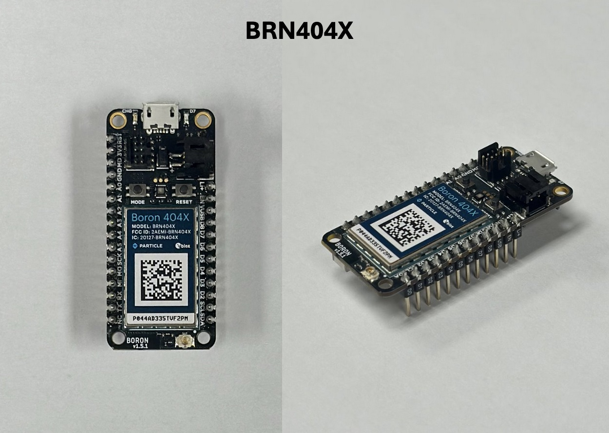 

Gently press the microSD card into the Adalogger FeatherWing until it clicks into place.

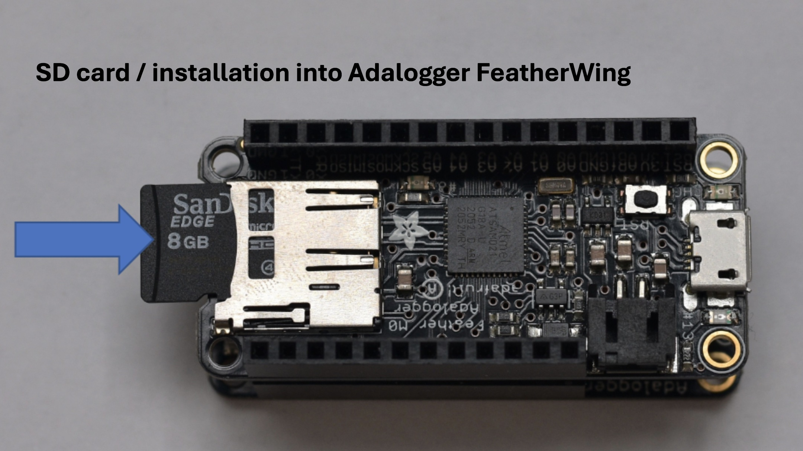

Using the USB A to Micro-B cable and your computer, udate the Boron's system firmware using the steps listed in the `Firmware` directory.

# Fabrication of electronics with enclosure

*Note: Start by taking the Boron off the Adalogger FeatherWing for ease.*

Optional: Twist the 3-pin cables (insert into a drill bit and spin slowly). Use shrink tubing to cover the cables.

Solder the 3-pin cable female receptacle onto the FeatherWing spare pins corresponding to the power, ground, and analog inputs.

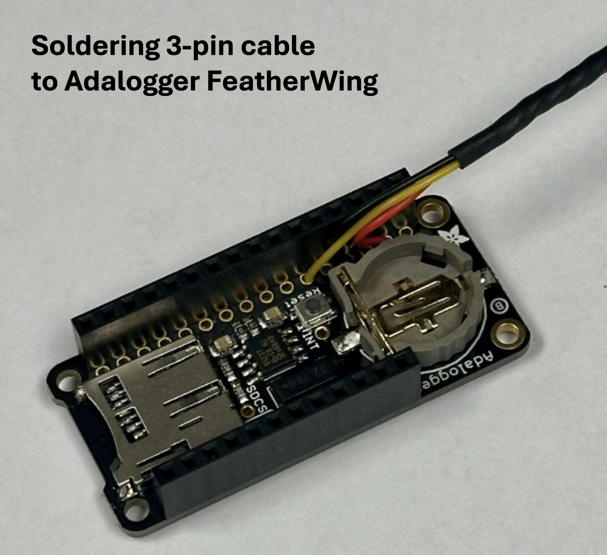

Solder the 3-pin cable male block onto the ultrasonic distance sensor on pins corresponding to the power, ground, and analog outputs.

Using a 5/8" spade bit, drill a hole in one of the Polycase's short ends 3/4" from the inner lip and centered horizontally.

Cut a 1" hole 1-1/4" into the Polycase lid. Tap 3/4 NPT threads

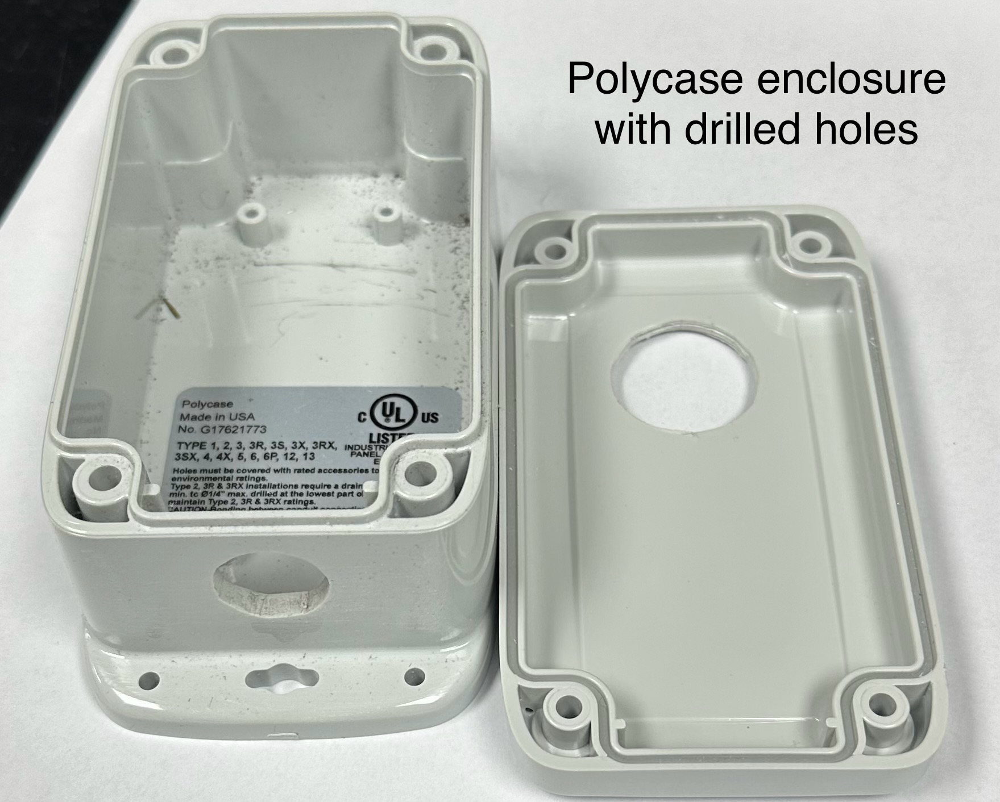
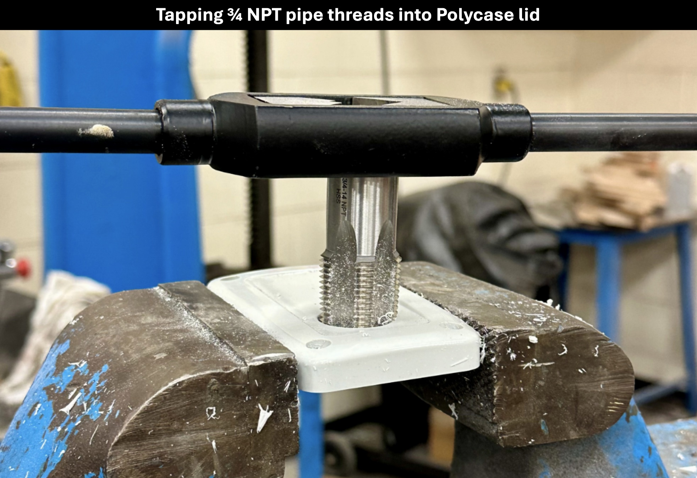

Wrap the ultrasonic distance sensor's threads with pipe tape; gently screw the distance sensor into the lid's hole. Use marine epoxy to create a waterproof connection here.

Cut the female 5V 2A connector of of the solar cable and strip the end. Cut the USB A connector of the USB A to Micro-B cable and strip the end. Solder the +5V wires together and the GND wires together. (Can use shrink tubing to keep red and black internal wires separate.) Cover this connection with shrink tubing / electrical tape / your preference.

Thread the upper two components of the cable gland onto the solar cable. Thread the solar cable through the 5/8" hole. Thread the bottom component of the cable gland onto the solar cable from inside the enclosure. Tighten cable gland.

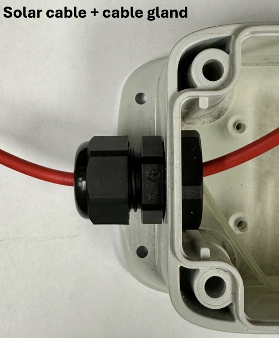

# Assembling the Chassis

Lay the Boron 404X and Adalogger FeatherWing with soldered header pins (hereby referred to as the BAda) atop the chassis so that the ...
- pins fit in the rectangular slots
- four holes in the BAda corners align with the four small holes in the chassis
- the microUSB port and 3-pin cable of the BAda are facing the end of the chassis with more lengthwise space

Screw the BAda to the chassis using the M2x0.45 18mm screws. Screw M2.5x0.45mm threaded 2mm length hex nuts to the screws on the underside of the chassis.
- Be cautious not to move too quickly or harshly, as you can strip the screw / hex nut, or crack the chassis!

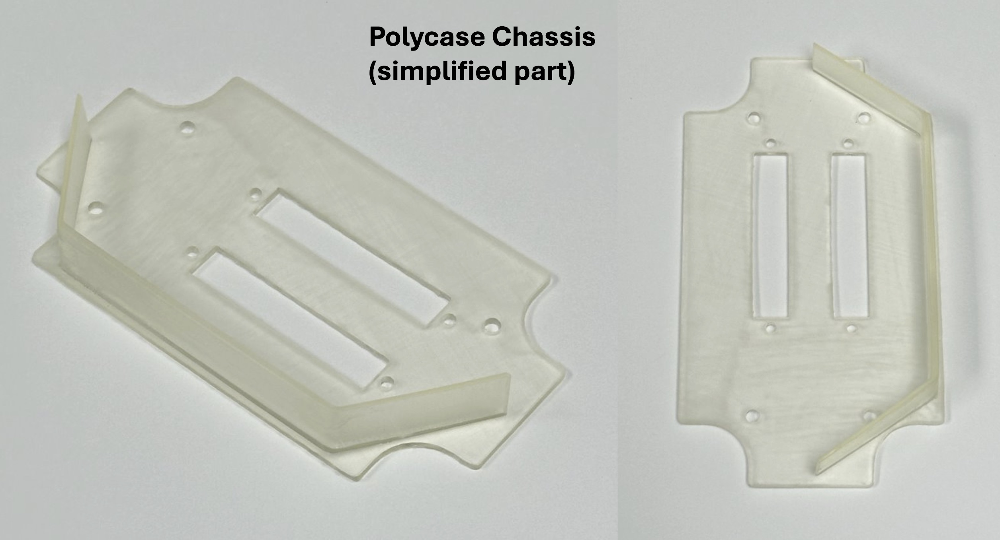
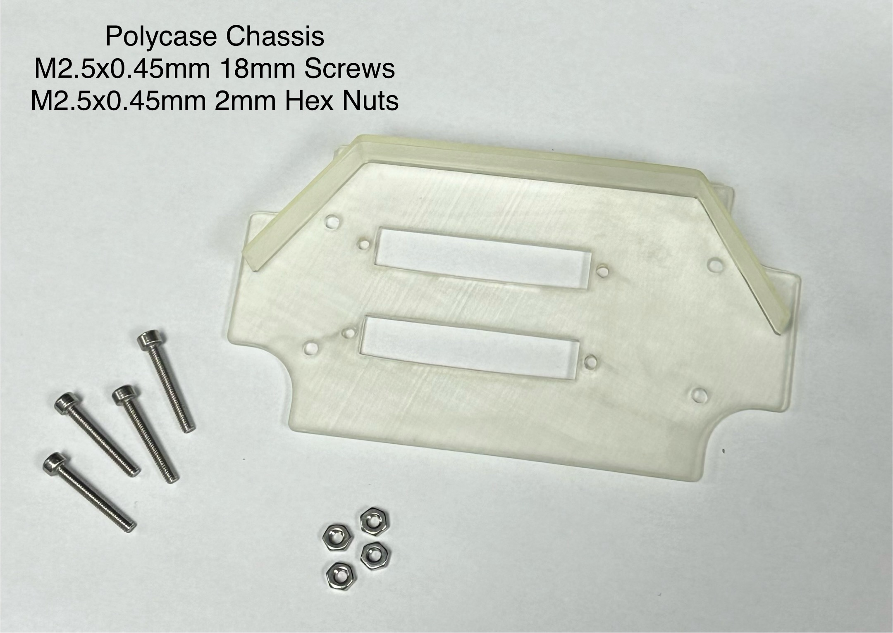
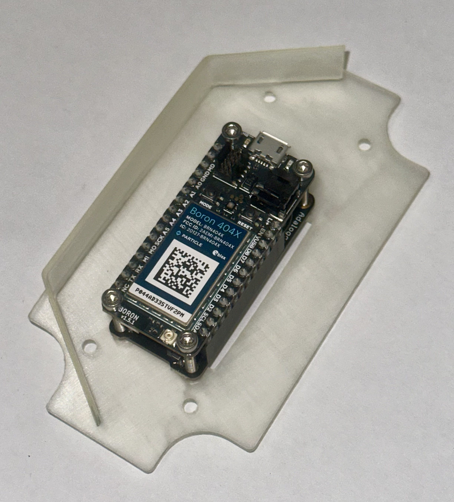
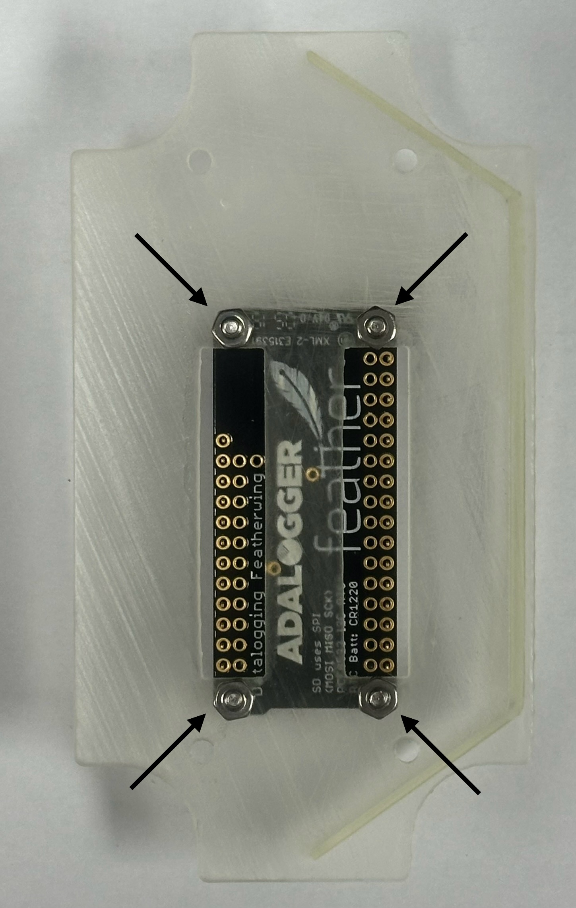

Carefully peel the sticker backing off of the cellular antenna and gently stick to the outside of the antenna frame on the chassis. Attach the antenna cable to the BAda.

Lay the chassis and electronics inside the Polycase so the BAda's microUSB port faces the side with the solar cable entry / cable gland.
Plug the microUSB solar cable into the port.

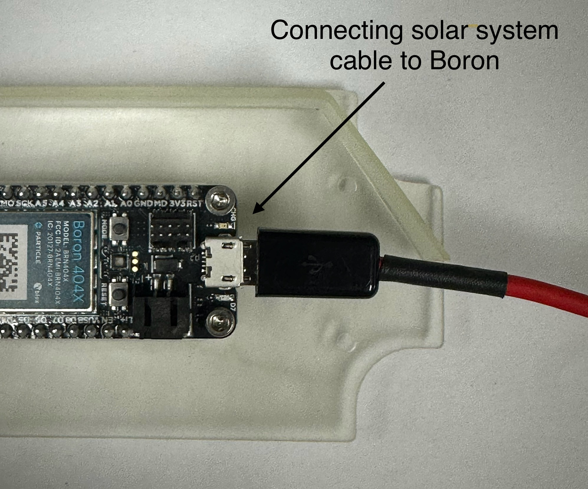

Screw the chassis with attached electronics into the Polycase using the Hi-Lo screws.
- Move with caution so as not to cause stripping!

Connect the white cap ends of the 3-pin cables.

Carefully fit all cords into the Polycase enclosure.

Place the Polycase lid on the enclosure, screwing it on with the included screws.

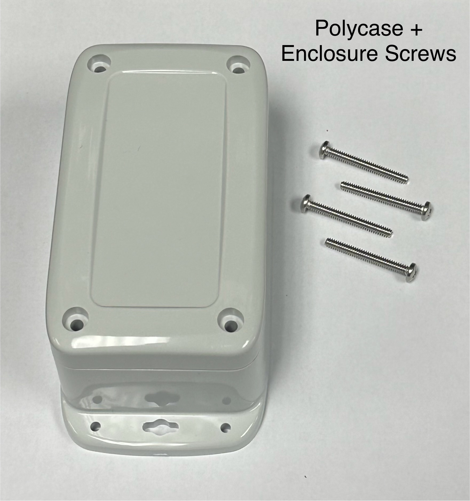
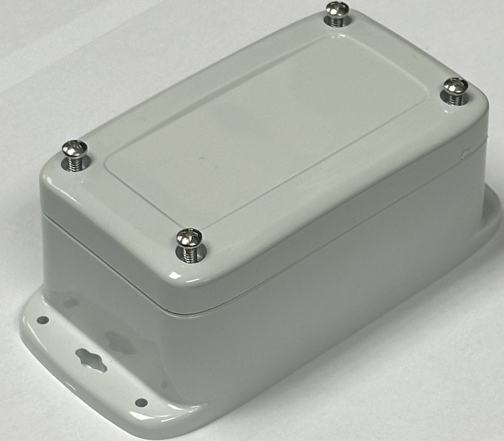