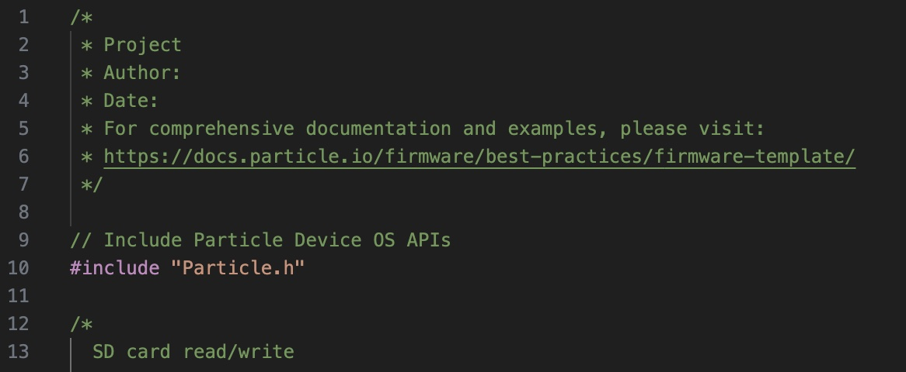

# Getting Started with Cell-Enabled Water Level Sensing
## Particle and Visual Studio
This section will help you set up Visual Studio Code and Particle Workbench, two important platforms you'll need for the following exercises.

1. Download Visual Studio (the one with the blue icon, not purple) [here](https://code.visualstudio.com/).
2. Download Particle Workbench [here](https://www.particle.io/workbench/) and create an account using your email address of choice (select 'Education' for account type if applicable). Make sure you have Visual Studio installed prior to running the installer.
	- The installer says that it will install Visual Studio (VS) along with Particle, but this does not work properly and will fail if VS is not installed first.
3. Log into Particle on Visual Studio if it doesn’t automatically (this is important because you won’t be able to install necessary libraries without being logged in).

## Useful features
This section lists some commands and programming features that will be helpful in the following exercises.

1. Open the Particle Command Palette: Ctrl+Shift+P on Windows; or Command+Shift+P on Mac; or select the 'view' tab -> Command Palette; or click the 'Launch Command Palette' button on the 'welcome' tab).
2. In the top right corner, there are some important symbols in white circles:
	- Compile: checkmark
	- Flash: lightning bolt
3. These symbols will be used later to compile and flash code (i.e. importing code to the Boron device).
4. Save your projects frequently using Ctrl+S on Windows or Command+S on Mac. Make sure your directory is just how you want it to avoid pathway issues in your coding projects!
5. Keep this in your back pocket, but don't use it yet: in cases where the Boron stops responding as expected or displaying error LED sequences, you may need to restore the device. Particle has an online, USB-based option here: [https://docs.particle.io/tools/device-restore/device-restore-usb/](https://docs.particle.io/tools/device-restore/device-restore-usb/).

## Common problems
This section lists some common problems you may encounter in the following exercises and how to address them.

Skip this section for now and try the **Practice Code with Boron** section first. Refer back to this list if you encounter problems.
1. If you receive a "No Device Found" or "Serial Time Out" message when using "Particle: Identify" ... First, double-check that you have selected Boron in the bottom right bar, have selected the correct OS version 4.2.0, and put the device in listening mode (by pressing and holding the Mode button until the LED blinks blue). If those settings are correct, try restarting your computer.
2. If you have problems in **Practice code with Boron and Adalogger** ... If Initializing SD Card and initialization failed, check that the micro SD card is empty. Plug it into your computer, open the SD card, and delete every file on it.
3. If met with error codes / unsuccessful compiling and a message stating that your file is dirty, try accepting the offer to 'clean' your file. If this doesn't fix the issue, try closing VS, deleting the project from your computer, and starting over.

## Practice code with Boron
This section will take you through an exercise to set up your Boron device and practice using code with it.

1. Plug in the Boron device to your computer using a micro-USB cable. Visit [https://docs.particle.io/tools/device-restore/device-restore-usb/](https://docs.particle.io/tools/device-restore/device-restore-usb/) and click 'Select Device.' Restore to the default system firmware version matching the example (not 'custom user firmware') and set the current compiled [target](SLR_Boron_Maxbotix_MB7092_cm/target) to be 4.2.0.
	- Note: If you get the message `Could not identify device: No serial port identified` but the Boron powers up, ensure that your cable has data transfer capabilities (many are only capable of charging).
2. Create a folder on your computer to store Particle-related items (no spaces in the title; use underscores (_) ... something like Particle_Items).
3. Create a new project by opening the Particle Command Palette (see: 'Useful features') and selecting 'Particle: Create New Project.' You can also click the blue text that says 'Create New Project' on the welcome page under Development Workflow -> Code.
4. Choose the folder you just made on your computer for this class when asked to choose the 'parent' folder.
5. Once you have the directory in which you want to store your Particle projects, create a project name (no spaces) ... Something like Blink_LED.
6. Copy the code from the file named `Blink_LED.ino` (not the one you just made but from the example [here](https://github.com/SUPScientist/Smart-Coasts/blob/main/Class-01-Intro/Blink_LED.ino)).
7. Navigate to the .cpp file that is generated for your new project under the 'src' tab on the left-hand side of screen (under 'explorer').
8. Delete all the text in the .cpp file after line 10 and paste the code you just copied.
	- Note: Make sure you leave lines 9-10 (seen below), as your .cpp file will not run properly without line 10.  
`// Include Particle Device OS APIs`  
`#include "Particle.h"`
	- Optional: Fill in applicable information (i.e. project name, author name, date, etc.) in lines 1-8 of the .cpp file; this info is for organizational purposes and will not affect your code.

9. Open the Command Palette. Type 'Particle' and select 'Particle Launch CLI.'
10. Configure Workbench to work with the Device OS that you confirmed you're using in the beginning of this section. Your settings should be across the bottom of the page; make sure the first setting says 'Boron' and the second says "deviceOS@[4.2.0 or your specific number]" by clicking and changing them if need be.
11. Put the Boron into DFU (Device Firmware Update) mode by pressing and holding the 'Mode' button on the Boron while simultaneously pressing and releasing the 'Reset' button. Continue holding 'Mode' until the RGB (Red Green Blue) LED starts flashing yellow.
12. Put the Boron in listening mode by pressing and holding 'Mode' until the LED blinks blue).
	- Note: You may have to press the ‘Reset’ button after putting the Boron in DFU mode and before putting it in listening mode if the LED doesn't begin blinking blue after a few seconds.
13. Type the following command into the CLI: `particle identify` ... The CLI results should present the OS with which you're working; for me, it is 4.2.0.
14. Open the Command Palette and run 'Particle: flash application (local)' to compile and flash your script (your .cpp file) to your device. If successful, this will result in the blinking of a blue LED near the micro-USB socket on the Boron.

## Practice code with Boron and Adalogger 
This section will take you through an exercise to set up the Boron and Adalogger devices and practice using code with them.

1. Stack the Boron on top of the Adalogger using female headers. You can see an example [here.](https://github.com/COAST-Lab/Open-Water-Level/blob/main/Firmware/Sensor%20How-To%20Images/BorAd%20Stack.jpg)
2. Plug in the Boron and put it in listening mode again (by pressing and holding 'Mode' until the LED blinks blue). Type `particle identify` into the CLI again and make sure 'Boron' and the correct Device OS (e.g. 4.2.0) are selected in the bottom bar.
3. Create a new project (I named mine RTCtest).
4. Open the Command Palette and type 'Particle: Install Library'
5. Type in 'SdFat' and press enter to install the SdFat library.
6. A new tab titled 'lib' should now be under the 'explorer' tab for this project on the left ... open it!
7. Click on 'examples' -> 'ReadWrite' -> 'ReadWrite.ino' 
8. Copy all the code on this page.
9. Now click the tab that says 'src' on the left, then '[yourprojecttitle].cpp'
10. In the .cpp file, delete all code after line 10 and paste the new code you just copied from the 'ReadWrite.ino' file.
	- Like earlier, make sure `#include "Particle.h"` is left in the code! Otherwise, your .cpp file won't work properly.
 	- You have the option again to fill in applicable information in lines 1-8.

12. In line 36, change `#define SD_CS_PIN SS` to `#define SD_CS_PIN D5` (SS -> D5)
13. After `File myFile;` create a new line and paste
`SYSTEM_MODE(SEMI_AUTOMATIC);
SYSTEM_THREAD(ENABLED);`
14. After `void setup(){` create a new line and paste `Cellular.off();` and in the next line paste `delay(5500);` 
15. Where it says `if (!SD.begin(SD_CS_PIN,)) {` paste `if (!SD.begin(SD_CS_PIN,SPI_FULL_SPEED)) {`

This image shows what your code should look like after you make the changes from steps 12-15.

16. Click the checkmark to compile the project (will take a minute).
17. Once it compiles, click the lightning bolt button to flash the code to the Boron. 
	- Boron should flash yellow/green when being put into DFU mode, then should breathe a white/blue light once it’s flashed.
	- Should also say it flashed successfully; unplugging and re-plugging the cord into Boron can sometimes help if it doesn’t flash.
18. Open the serial monitor: Command Palette -> 'Particle: Serial Monitor'
 	- Select 'yes' if prompted whether you want to 'automatically reconnect when port is closed'
20. If the Adalogger does not work, the serial monitor may read something like the first chunk of text below. If it does work, it should read like the second chunk of text.

	

22. If you encounter problems, go to **Common Problems** and double check that you did each step correctly. You can also try pressing the 'Reset' button on the Boron, or unplugging and re-plugging the cord.

## Practice water level sensor full code (Boron and Adalogger) 
This section will allow you to practice using water level sensor code and working with the Boron and Adalogger devices.

1. Wiring Connection between Boron/Adalogger stack and water level sensor: The water level sensor's AN pin will connect to the A1 pin of the Boron. Ground the water level sensor by connecting GND to GND on the Boron and connect to power by connecting +5 to 3v3 on the Boron. Example [here.](https://github.com/COAST-Lab/Open-Water-Level/blob/main/Firmware/Sensor%20How-To%20Images/MAX.jpg)
2. On the GitHub repository, go to 'Firmware' -> 'SLR_Boron_Maxbotix_MB7092_cm' -> 'src' -> 'SLR_Boron_Maxbotix_MB7092_cm.ino' (or follow [this link](https://github.com/COAST-Lab/Open-Water-Level/blob/main/Firmware/SLR_Boron_Maxbotix_MB7092_cm/src/SLR_Boron_Maxbotix_MB7092_cm.ino))
3. Copy all the code on this page.
4. In Particle Workbench, create a new project (I named mine BAdaFull).
 	- See 'Useful features' and 'Practice code with Boron' if you need a refresher on how to create a new project.
5. Open the Command Palette and type 'Particle: Install Library' 
6. Type in 'SdFat' and press enter to install the SdFat library.
7. Go to the .cpp file in the new project you created (it should have the same name as your project).
8. Delete all code after line 10 and paste the new code you copied from GitHub (remember: keep `#include "Particle.h"`).
9. Add lines before `//------------------State variables` and paste:

`// function prototype`  
`int secondsUntilNextEvent();`

10. In line 45, replace the `1` after `#define PUBLISHING` with `0`
 	- This step is very important! It ensures that publishing and cellular connection do NOT occur, which is what we want for this test run.
	- Once a device is deployed in the field with the intent of publishing data, this binary value can be changed (but we aren't dealing with that quite yet, so make sure you change `1` to `0`!)
11. Make sure line 52 says `SEMI_AUTOMATIC` not `AUTOMATIC`
12. In lines 51-52, change the comments so that 51 is uncommented (delete the double slashes in front of the line) and 52 is commented out (add double slashes in front of the line).

13. In line 62, where it says `const unsigned long MAX_TIME_TO_PUBLISH_MS = 60000` change the `60000` to `20000`
14. Comment out the lines below; these should be around 187-190 depending on how many new lines you created.
	- You can select all the text in those lines using the shortcut Ctrl+/
	- The image below shows what your lines of code should look like once commented out.

16. Compile and flash code to the Boron device.
	- If your device is not responding or the flash is unsuccessful, try unplugging/replugging the cord or putting the Boron in DFU mode (press and hold 'Mode' while pressing and releasing 'Reset').
17. Quickly open the serial monitor: Command Palette -> 'Particle: Serial Monitor'
18. It may take a moment, but the terminal should look something like the picture below. The serial monitor should say `serial connection closed. Attempting to reconnect…`
	- If it still doesn't work, try the problem-solving methods from Step 16 again.

19. The numbers produced in the serial monitor represent four useful data values, listed as follows: Unix timestamp (seconds since 1 Jan 1970 UTC), distance measured by the sensor (cm), battery voltage (volts), battery level (%)
	- See lines 134-138 (pictured) for where these values are printed in the code

20. To finish collecting data, unplug the Boron to stop the code from running.
21. To check all the collected values, take out the SD card from the Adalogger and put it into an SD card reader to then plug into your computer.
22. Navigate to 'file explorer' -> 'this PC' -> 'USB drive' -> `distance.txt`. You should see values like below!

***** ISSUE: I DON'T HAVE AN SD CARD READER SO I CAN'T TELL IF THIS IS WHAT IS SHOWN ONCE THE DATA IS UPLOADED TO A COMPUTER OR IF THESE VALUES SHOULD ACTUALLY MATCH THOSE IN STEP 19

23. Unix time values are listed first, then another value, and then the distance (cm) values, followed by a semi-colon.

***** ISSUE: SEE ABOVE ISSUE, APPLIES HERE TOO
